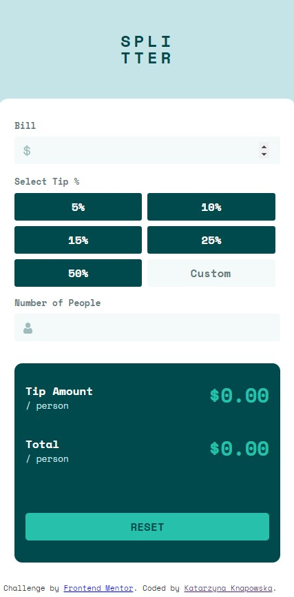

# Tip calculator app solution (Frontend Mentor challenge)

This is a solution to the [Tip calculator app challenge on Frontend Mentor](https://www.frontendmentor.io/challenges/tip-calculator-app-ugJNGbJUX).

### The challenge

Users are able to:

- View the optimal layout for the app depending on their device's screen size
- See hover states for all interactive elements on the page
- Calculate the correct tip and total cost of the bill per person

### Screenshot

### Built with

- Semantic HTML5 markup
- SCSS
- Flexbox
- Mobile-first workflow / RWD
- Vanilla JS - ES6 (class)

#### Author: Katarzyna Knapowska